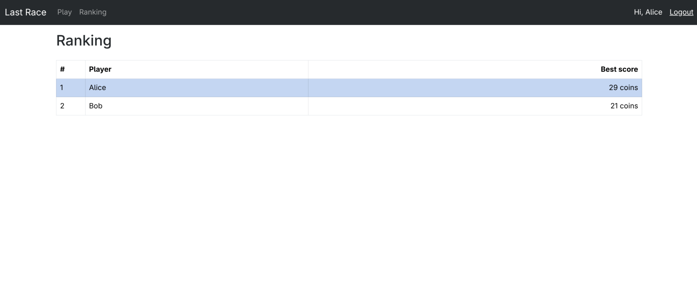
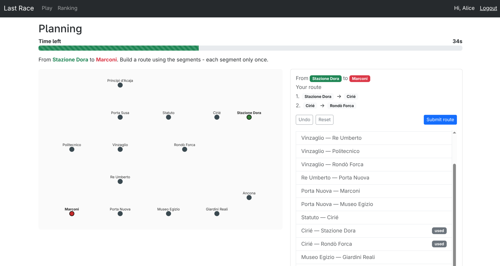

# Exam #1: "Last Race"
## Student: s362563 FLO ANDREAS HEDBERG

## React Client Application Routes

- Route `/`: Public instructions / landing page. Shows how to play.
- Route `/login`: Login form (email + password). Public; redirects to `/play` if a user is already authenticated.
- Route `/logout`: Performs logout and redirects to `/`. No visible page.
- Route `/play`: The game itself (`GameView`), driving the setup → planning → execution → result flow. Protected: anonymous users are redirected to `/login`.
- Route `/ranking`: The general ranking page with each user's best score. Protected: redirects to `/login` if not authenticated.
- Route `*`: Catch-all "Page not found" fallback.

## API Server

- POST `/api/sessions`
  - request body: `{ username, password }` (both required; validated with express-validator)
  - response body: the authenticated user `{ id, username, name }` (201), `401` on bad credentials, `422` on validation errors
- GET `/api/sessions/current`
  - request parameters: none (uses session cookie)
  - response body: the current user `{ id, username, name }`, or `401 { error }` if not authenticated
- DELETE `/api/sessions/current`
  - request parameters: none
  - response body: empty (logs the current user out)
- GET `/api/network/full` (auth required)
  - request parameters: none
  - response body: `{ stations: [{id, name, x, y, interchange}], lines: [{id, name, color, stops:[stationId,...]}] }`. Used only in the Setup phase to draw the full map with lines.
- GET `/api/network/stations` (auth required)
  - request parameters: none
  - response body: `[{ id, name, x, y, interchange }]`. Stations only: interchange is always set to `false`. 
- GET `/api/network/segments` (auth required)
  - request parameters: none
  - response body: `[{ id: "a-b", a, b }]`. The bare list of connected station pairs, **without** line information. Used to build the route during Planning.
- POST `/api/games` (auth required)
  - request parameters: none (server picks the endpoints)
  - response body: `{ gameId, startStation, destStation, startedAt, durationSeconds }`. Server randomly assigns a start/destination pair with BFS distance ≥ 3 and records the start time. The station and segment lists for Planning are fetched separately via `/api/network/stations` and `/api/network/segments`.
- POST `/api/games/:id/submit` (auth required)
  - request parameters: `:id` game id (int); body `{ route: [{ a, b }, ...] }` (validated)
  - response body: `{ valid, reason?, steps:[{stepIndex, from, to, description, effect, coinAfter}], finalScore }`. Server enforces the 90s timer (+5s grace) and ownership, validates the route, then runs the random events. Invalid/expired/incomplete routes return `valid:false` with `finalScore:0`. Returns `403` (not owner), `404` (no such game), `409` (already submitted), `422` (validation).
- GET `/api/ranking` (auth required)
  - request parameters: none
  - response body: `[{ name, bestScore }]`, the best completed-game score per user, descending.

## Database Tables

- Table `users` - registered users: `id`, `username` (login email), `name` (display name), `password` and `salt` (scrypt-hashed credentials).
- Table `lines` - metro lines: `id`, `name` (unique), `color` (hex, used by the client map).
- Table `stations` - stations: `id`, `name` (unique), `x`/`y` layout coordinates for the SVG map.
- Table `line_stops` - ordered stops of each line: `line_id`, `station_id`, `position`; consecutive rows on a line define its segments.
- Table `events` - random journey events: `id`, `description`, `effect` (integer in -4..+4).
- Table `games` - one row per played game: `id`, `user_id`, `start_id`, `dest_id`, `started_at`, `submitted_at`, `status` (`planning`/`done`), `final_score`.
- Table `game_steps` - per-segment audit of a game's execution: `game_id`, `step_index`, `from_id`, `to_id`, `event_id`, `effect`, `coin_after`.

## Main React Components

- `App` (in `App.jsx`): Top-level component; holds the `user` state, restores the session on load, defines all routes inside a shared `MainLayout`, and gates protected routes.
- `Header` (in `Header.jsx`): Navbar with login/logout controls and Play/Ranking when logged in. Reads the user from `UserContext`.
- `LoginForm` / `Logout` (in `LoginForm.jsx`): Controlled login form. `Logout` performs the logout side effect.
- `GameView` (in `GameView.jsx`): The game state machine. Manages phase (`setup`/`planning`/`executing`/`result`), the lean station/segment lists, the built route, and submission.
- `SetupView` (in `SetupView.jsx`): Fetches and shows the full network map with lines, plus the "Start game" button. Owns the full network so it is removed from memory when the game progresses to the Planning phase.
- `NetworkMap` (in `NetworkMap.jsx`): SVG map. Draws colored lines (Setup) or just stations (Planning), highlighting start/destination.
- `PlanningView` (in `PlanningView.jsx`): Lays out the line-less map, the countdown, and the route builder during planning.
- `CountdownTimer` (in `CountdownTimer.jsx`): 90-second countdown with a progress bar; calls `onExpire` to auto-submit when time runs out.
- `RouteBuilder` (in `RouteBuilder.jsx`): Shows the route being built and Undo/Reset/Submit controls.
- `SegmentList` (in `SegmentList.jsx`): Scrollable list of all segments. Only unused segments are clickable.
- `ExecutionView` (in `ExecutionView.jsx`): Reveals the executed steps one at a time with each event and the running coin total.
- `ResultView` (in `ResultView.jsx`): Shows the final score (and invalid-route reason) plus a "Play again" button.
- `RankingView` (in `RankingView.jsx`): Fetches and renders the ranking table, highlighting the current user's row.

## Screenshots

## Users Credentials

- **username**: alice@last.race, **password**: alice123
- **username**: bob@last.race, **password**: bob123
- **username**: carol@last.race, **password**: carol123

Alice and Bob have both played multiple games. Carol has none.

## Use of AI Tools

AI assistance (Claude) was used to generate a coarse-grained plan for the project, as well as to generate scaffolds for boilerplate code (sql seed file, HTTP endpoint creation based on DAO updates). 
The plan was read and edited to make sure it fit the exam task description and the course content. Generated code scaffolds were read, refined/filled, run and tested manually. 

The same AI tool was also used for code review, in order to quickly gain "another perspective" on the code, to make sure it aligned with course patterns and the task description.

Lastly, Claude was used in the creation of this document. That is, the sections *React Client Application Routes*, *API Server*, *Database Tables* and *Main React Components*. These were all read, modified and cross-referenced with the code base.
